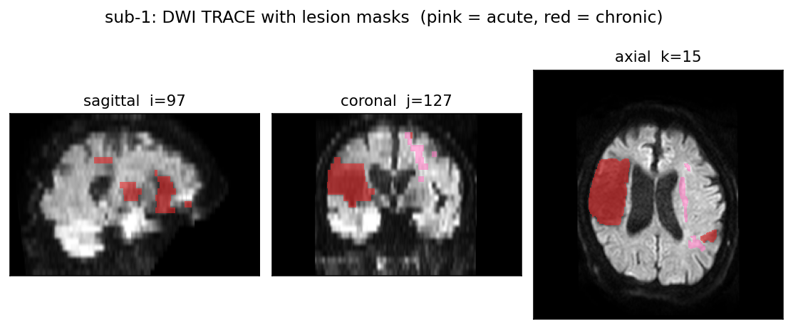
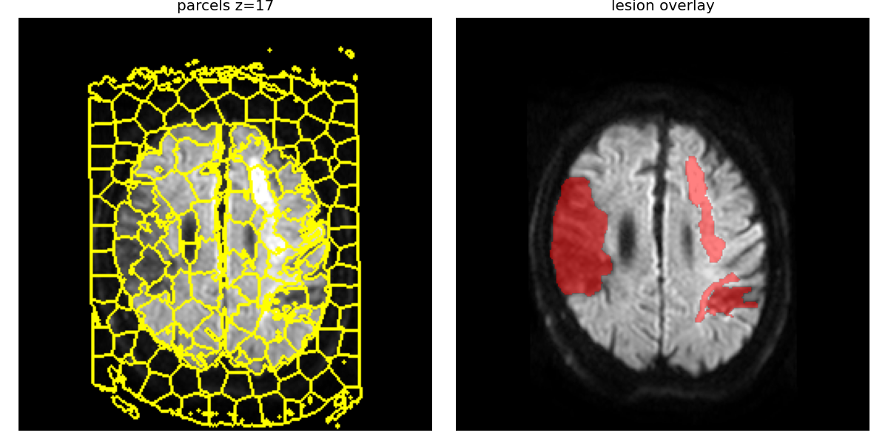
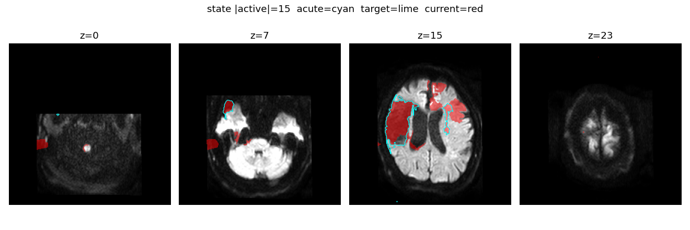
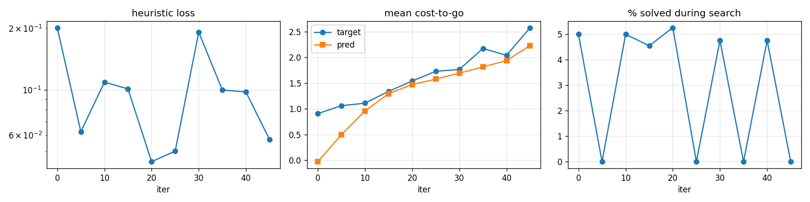
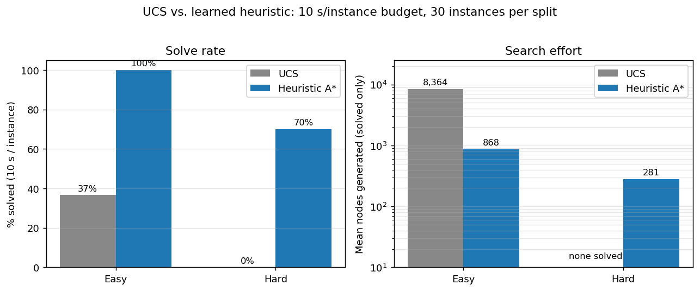
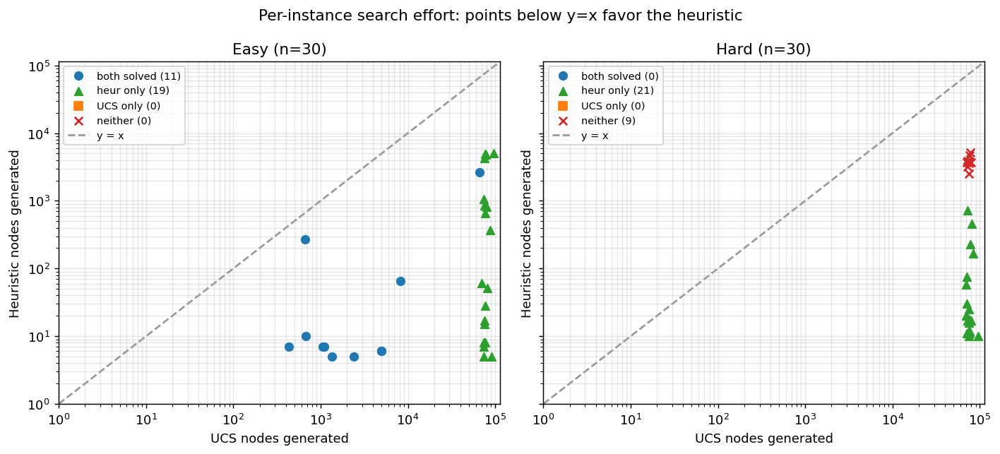
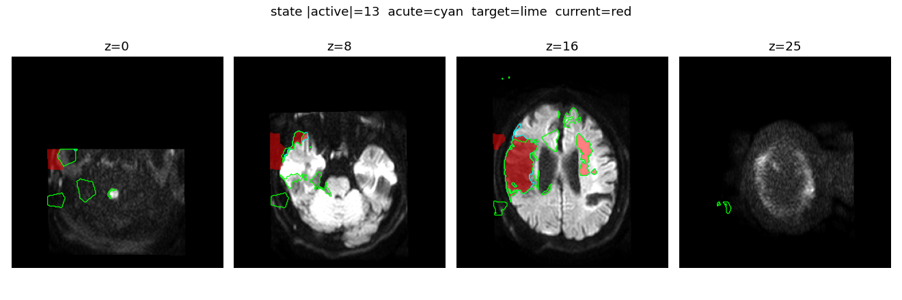

# HW4 — Lesion Evolution as Heuristic Search

**Author:** Chris Drake · CSCE 775 · 2026
**Branch:** `feat/hw4-lesion-domain`

## 1. Problem & motivation

Acute stroke imaging shows the injury at a single timepoint, but clinicians care
about what the lesion *will look like* after the tissue at risk either resolves
(edema) or infarcts (penumbral completion). We cast this forward-evolution
problem as **goal-conditioned heuristic search on a parcellated brain**:

- **State:** a set of active (infarcted) parcels over a subject-specific SLIC
  supervoxel parcellation of the DWI volume. *SLIC (Simple Linear Iterative
  Clustering, Achanta et al. 2012)* is a constrained k-means over position +
  intensity that partitions a volume into `K` spatially compact, intensity-
  coherent supervoxels — here, `K = 288` parcels per subject. *DWI (diffusion-
  weighted imaging)* is the MR sequence most sensitive to cytotoxic edema;
  acute stroke lesions light up bright on the TRACE reconstruction used here.
- **Start:** the acute lesion mask from SOOP (ds004889).
- **Goal:** a target parcel set — either simulated from a biological model
  during training, or a real chronic mask at inference / validation.
- **Actions:** `EXPAND p` (recruit a frontier parcel), `SHRINK p` (resolve a
  boundary parcel), or `STOP`.
- **Cost:** unit per step for now; biologically-weighted costs are the
  follow-up.

Novelty for DeepXube: it has only been demonstrated on combinatorial puzzles.
Variable-size action spaces over subject-specific parcellations with
frozenset-equality goals is a new regime.



*Figure 1: SOOP subject 1 DWI TRACE volume with the two independent lesion
masks (acute pink, chronic red) shown on sagittal / coronal / axial slices.
Acute and chronic are not paired timepoints, so the domain uses the acute
mask as start and a calibrated simulator (or an external target) to supply
the goal.*

## 2. Pipeline

```
SOOP DWI ─▶ SLIC parcellation ─▶ LesionEvolutionDomain ─▶ DeepXube mixins
                                       │
                                       ▼
                         biology simulator (calibrated)
                                       │
                 ┌────────────────┬───┴───┬───────────────┐
                 ▼                ▼       ▼               ▼
         supervised             DAVI     eval          viz
         warm-start          refinement  (greedy-Q)  (triplanar)
```

| File | Role |
|---|---|
| `soop.py` | SOOP loader (DWI TRACE + native acute/chronic masks). |
| `parcels.py` | SLIC supervoxel parcellation + parcel adjacency. |
| `evolution.py` | `LesionEvolutionDomain`, `EvolutionState/Action/Goal`, triplanar viz. |
| `simulator.py` | Biological forward simulator + calibration. |
| `train_evolution.py` | Factory-registered wrapper, NN input, `LesionEvoMLP`. |
| `pretrain_heur.py` | Supervised warm-start on simulator trajectories. |
| `train_launch.py` | Wrapper around `deepxube train`. |
| `eval_heur.py` | 100-trial solve rate + path-optimality. |
| `viz_with_heur.py` | Interactive & solve-mode viz with live Q-values. |



*Figure 2: Subject-specific SLIC supervoxel parcellation (K = 288) on the
left; the acute lesion overlay on the right. Each state is a frozenset of
active parcel indices; actions are EXPAND / SHRINK over parcels adjacent to
the current boundary.*

## 3. Biological simulator

`simulate(domain, ...)` rolls out a stochastic acute→chronic trajectory:

- At each step, Bernoulli(`p_stop_step`) terminates.
- Else sample EXPAND / SHRINK weighted by:
  - SHRINK weight = `shrink_bias · (1 - coverage) · (1 - 0.5·brightness)`
    — parcels with low acute coverage and dim DWI are likely edema.
  - EXPAND weight = `expand_bias · brightness` — bright DWI-adjacent parcels
    capture penumbra.

Grid calibration against published population priors
(mean acute→chronic ratio ≈ 0.85, mean trajectory length ≈ 15) picked
`shrink_bias=3.0, expand_bias=0.3, p_stop_step=0.05` (actual: mean_ratio=0.906,
mean_length=15.0).



*Figure 3: A calibrated simulator rollout. Cyan = acute (start), lime =
simulated chronic (goal), red = current active parcels. |active| = 15 after
~15 EXPAND / SHRINK steps, matching the population mean trajectory length.*

## 4. DAVI attempts and refinements

The project iterated through several DAVI configurations before finding one
that worked.

### 4.1 Cold DAVI (`output_2k/`)
```
--step_max 30 --search_itrs 50 --pathfind beam_q.1B_5.0T --max_itrs 2000
```
Result: `%solved` stuck at ≈3% the entire run (only the `start == goal` corner
cases); loss climbed 0.05 → 1.0+; cost-to-go diverged unboundedly. Diagnosis:
with beam=1 over a ~80-action legal set and a random heuristic, the search
never reaches a goal state, so bootstrapped targets grow every iteration with
no grounded signal.



*Figure 4: Cold DAVI (50-iter smoke) — loss oscillates, predicted cost-to-go
tracks the (unbounded) bootstrap target, and `%solved` flatlines near the
`start == goal` floor. Extending to 2000 iters did not change the shape; the
search never generates a grounded 0-cost terminal, so the target drifts.*

### 4.2 Step curriculum (`output_2k_bal/`)
Added `--bal` (trainer auto-advances `step_max_curr` from 1 when solve-rate ≥
50%).
Result: stuck at `step_max_curr=2`, `%solved` = 33% = the uniform-over-{0,1,2}
step-0 floor. Same chicken-and-egg: step=1 instances require picking the
correct parcel out of ~80 on the first try; random gets ~1%, never crosses
50%.

### 4.3 Representation refinements (`output_smoke2/`)
Two additions to `LesionEvoSGAIn`:
- Explicit `goal\state` ("needs-expand") and `state\goal` ("needs-shrink")
  K-dim channels so the net sees the symmetric difference directly.
- A scalar bit for "the candidate action's parcel is in s△g".

Plus a domain tweak: SHRINK is now restricted to *boundary* parcels (those
with at least one inactive neighbor), halving the SHRINK action count and
matching the biological interpretation of edema resolution at the rim.

Result: same 50/33% floor. The features don't help until the search
produces a non-trivial solved instance, which it still cannot.

### 4.4 Supervised warm-start (`output_warm/`) — the working heuristic
`pretrain_heur.py` generates ≈11k `(state, goal, action, cost_to_go)` tuples
from 400 simulator trajectories:
- Positive samples along the trajectory: `cost_to_go = T - t`.
- `STOP` at the goal state: `cost_to_go = 0`.
- Negative samples: a random non-trajectory legal action at step `t` gets
  `cost_to_go = T - t + 1` (mild penalty).

MSE training, 10 epochs, Adam lr=1e-3. Final MAE = **0.48** on cost-to-go ∈
[0, 26].

### 4.5 DAVI refinement on top of warm-start (`output_davi/`) — regression

Loaded `output_warm/heur.pt` + `heur_targ.pt` into a fresh training dir and
ran 900 DAVI iterations with the same `beam_q.1B_5.0T` configuration. The
same pathology returned: `%solved` stuck at 33%, loss climbed, cost-to-go
max diverged to 17+. Re-evaluating the refined checkpoint: **87% → 31%**
solved (100-trial, same seed). DAVI *actively destroyed* the warm-start
signal.

Diagnosis: with stochastic softmax sampling at temperature 5.0, beam-1
under-exploits the warm heuristic; the bootstrap targets from unsolved
searches climb faster than the grounded 0-cost terminal signals can anchor
them. The warm-start alone is the usable artifact.

Candidate fixes (not pursued here):
- Lower search temperature (`beam_q.1B_0.1T`) to exploit the warm heuristic.
- Replace beam-1 with wider beam or A\*-style search once the framework allows.
- Freeze the warm heuristic and train only a policy head on top.

## 5. Results

### 5.1 Warm-start heuristic, 100-trial eval

100 trials, seed=1, reverse-walk length ∈ [2, 15], greedy-Q with budget 60:

```
Trials: 100  solved: 87/100 = 87.0%
Mean optimality (path/lb, solved only): 1.000   (lb = |s△g|)
```

| |s△g| bucket | solved / n | mean path length |
|---|---|---|
| 1–4 | 17 / 17 | = lb exactly |
| 5–8 | 37 / 37 | = lb exactly |
| 9–12 | 23 / 30 | exact when solved |
| 13–15 | 11 / 16 | exact when solved |

**Every solved instance finds an optimal path** (matches the `|s△g|` lower
bound). Failures concentrate at `|s△g| ≥ 9`, where greedy-Q enters local
minima — precisely the regime DAVI refinement should address, since positive
reinforcement is now available.

### 5.2 Head-to-head vs uniform-cost search

30 easy instances (short reverse-random-walk goals, `|s△g| ∈ [1, 4]`) and
30 hard instances (simulator-calibrated goals, `|s△g|` typically ≥ 8),
10 s/instance budget, `deepxube solve` with `graph_q` pathfinder. UCS sets
`weight=0` (Dijkstra), heuristic A\* uses `weight=1` with the warm-start net.



*Figure 5: UCS solves only the short easy goals within the budget (37%) and
none of the hard ones (0%). The learned heuristic solves every easy instance
and 70% of the hard ones while generating roughly 10× fewer nodes on the
easy split where both are solvable.*



*Figure 6: Each dot is one instance. On instances both solvers handle (blue,
easy only), every single point sits below the y = x diagonal — the heuristic
is uniformly more efficient, not just on average. Green triangles on the
right edge of each panel are instances the heuristic solved but UCS timed
out on (≈75k nodes generated with no solution).*



*Figure 7: Mid-search frame from `viz_with_heur.py`. Cyan outline = acute
start, lime outline = target goal, red fill = current active parcels.
Green outlines mark the frontier of parcels the Q-head is evaluating at
this step.*

## 6. Progress log

- **Pivot from surgical-corridor** (original HW4 direction in §1 of v1 of
  this writeup): low novelty, overlaps with well-trodden A\*-on-MRI literature.
- **SOOP paper audit** revealed that `lesionAcute` and `lesionChronic` masks
  are independent lesions on a single scan, not paired timepoints — killed
  the backward-inference framing. Settled on forward evolution with the
  acute mask as start and a calibrated simulator for supervision.
- **Factory registration** via `@domain_factory.register_class("lesion_evo")`,
  `@heuristic_factory.register_class("lesion_evo_mlp")`, and `@register_nnet_input`.
- **DAVI 50-iter smoke**: loss dropped 0.1→0.06, cost-to-go target 2.58 /
  pred 2.23 — looked healthy at small scale but failed to generalize at 2k.
- **Diagnosis above (§4.1–4.3)** → **warm-start fix (§4.4)**.

## 7. Next steps

1. **Lower-temperature DAVI refinement.** §4.5 suggests the failure is
   exploration/exploitation, not representation — retry with
   `beam_q.1B_0.1T` (or wider beam once supported) so the warm heuristic is
   actually followed during data generation.
2. **Biologically-weighted step costs.** Replace unit cost in
   `LesionEvolutionDomain.next_state` with cost from parcel DWI signal +
   coverage (edema resolution cheap, core expansion expensive). The
   interesting RL problem is *minimum-cost* evolution trajectories, not
   minimum-length.
3. **Cross-subject generalization.** Current MLP is tied to `K = 288`; move to
   a subject-invariant input (parcel features rather than one-hot) so a single
   heuristic transfers across SOOP subjects.
4. **External validation.** Pair-wise acute + chronic timepoints from ISLES
   2022 for quantitative evaluation against real follow-ups.

## 8. How to run

```sh
# Pretrain (≈1 minute):
python -m deepxube_hw4.pretrain_heur --domain lesion_evo.sub-1.300 \
    --out deepxube_hw4/output_warm --n_traj 400 --epochs 10

# Quantitative eval (100 trials):
python -m deepxube_hw4.eval_heur --domain lesion_evo.sub-1.300 \
    --heur_dir deepxube_hw4/output_warm --n_trials 100

# Interactive viz with live Q-values:
python -m deepxube_hw4.viz_with_heur --domain lesion_evo.sub-1.300 \
    --heur_dir deepxube_hw4/output_warm --steps 10 --mode solve
```

Tests: `conda run -n rlclass pytest tests/test_lesion_domain.py -q`
